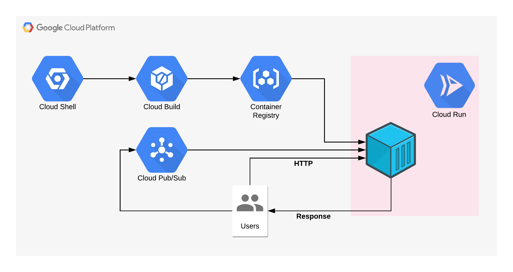
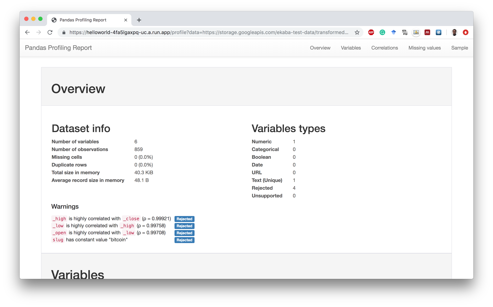

# Cloud Run: Dataset Summaries via HTTP Request

    

 

This repository provides code for utilizing Cloud Run to run a stateless container that uses Pandas profiling to display the summary statistics from a structured CSV dataset. The CSV file is passed to the container via a HTTP request from the parameter `data`.

## Get Started
In the steps below, replace the name `ekabasandbox` with your GCP Project ID.

1. Open Google Cloud Shell.
2. Clone this repository by running `git clone https://github.com/dvdbisong/google-cloud-run.git`.
3. Navigate to the code folder folder: `cd pandas-profile`.
4. Build the container using Cloud Build: `gcloud builds submit --tag gcr.io/ekabasandbox/pandas_profile`
5. Deploy to Cloud Run: `gcloud beta run deploy --image gcr.io/ekabasandbox/pandas_profile --platform managed --memory 1Gi`
6. Pass a hosted CSV file to the application deployed on Cloud Run via the link. For example: `https://helloworld-4fa5lgaxpq-uc.a.run.app/profile?data=https://storage.googleapis.com/ekaba-test-data/transformed-crypto-bitcoin-00-of-02.csv`

    

**Blog post for this project: <a href="https://ekababisong.org/google-cloud-run/">https://ekababisong.org/google-cloud-run/</a>**